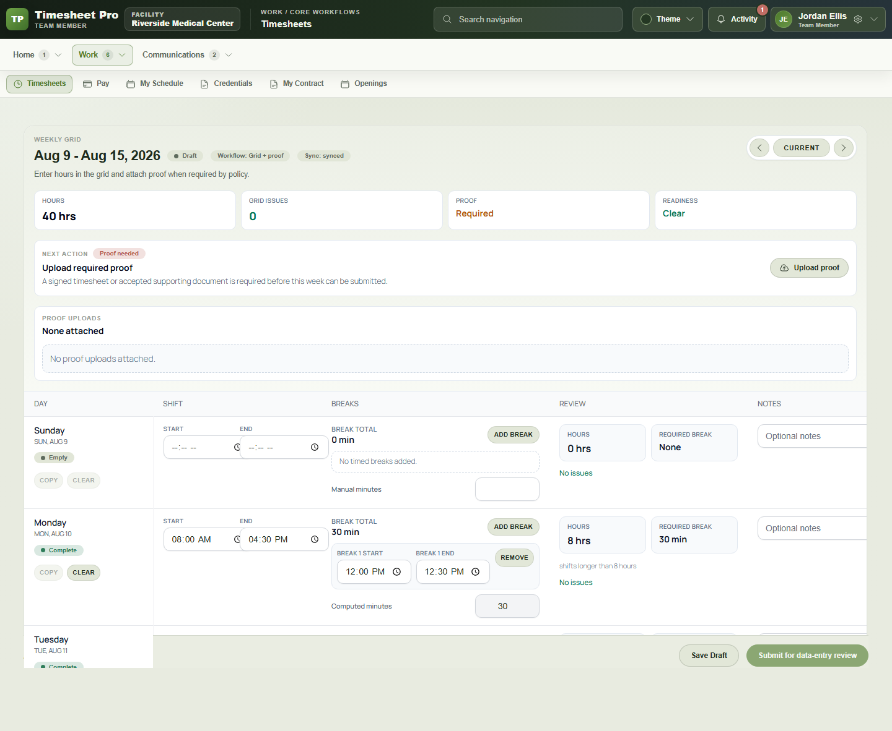

# Brian Karanja — Software and Systems Portfolio

I build business applications and the systems that support them. My work combines frontend interfaces, backend services, databases, permissions, deployment and user support.

**Full-Stack Developer · Systems Administrator · Nairobi, Kenya**

[Email](mailto:haurezbrian@gmail.com) · [GitHub](https://github.com/haurezbrian)

## Software projects

| Project | Delivered functionality | Technical focus |
| --- | --- | --- |
| [Timesheet Pro](case-studies/timesheet-pro.md) | Time capture, proof checks, approvals and payroll preparation | Workflow rules, PHP services, React interfaces |
| [Orvane Energy](case-studies/orvane.md) | Staff workspace, solar assessments, proposals and handover | Full-stack workflows, permissions, audit history |
| [Seraphim / Pemerton Realty](case-studies/seraphim.md) | Property search, comparison, maps and catalogue management | API integration, geospatial data, responsive interfaces |
| [Dainty Divas](case-studies/dainty.md) | Storefront, cart, checkout, delivery and payment integration | Commerce APIs, payment states, end-to-end testing |
| [Carnova](case-studies/carnova.md) | Travel discovery, trip planning and request intake | Connected frontend/backend workflows and notifications |
| [Afri Roofing & Flooring](case-studies/wordpress-implementation.md) | Business website, product catalogue and quotation selections | WordPress configuration, JavaScript and owner handover |

## Selected interfaces

### Seraphim / Pemerton property discovery

[View the project](case-studies/seraphim.md)

### Timesheet Pro weekly workflow

[View the project](case-studies/timesheet-pro.md)

## Systems and implementation

My infrastructure and support work includes Microsoft 365 and Windows Server administration, remote-team onboarding, email troubleshooting, hospitality networking, CCTV and Oracle MICROS Simphony configuration.

At Panache Technohub, I also supported Microsoft Dynamics 365 Business Central customisation, testing and rollout.

[Systems and implementation experience](case-studies/systems-and-implementation.md)

## Development tooling

I worked on a reusable project foundation with five setup profiles, Docker Compose templates, GitHub Actions and operating documentation. Its initializer includes localhost port-allocation checks, registry locking and atomic updates.

[Development tooling](case-studies/development-tooling.md)

## Technical writing

[Calendar synchronisation troubleshooting](support/calendar-integration-scenario.md) — an operational reference for investigation, customer communication and verification.

Application source remains in private repositories. These project pages describe the implemented work and my contribution.

## Contact

[haurezbrian@gmail.com](mailto:haurezbrian@gmail.com) · Nairobi, Kenya
