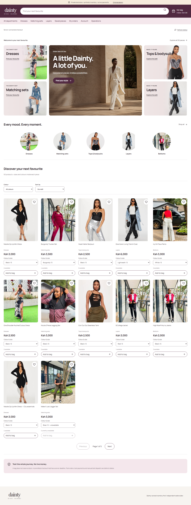

# Dainty Divas

A retail application connecting product discovery, cart, guest checkout, delivery selection and payment handling.

**My role:** Full-stack development  
**Stack:** React, TypeScript, Vendure and Paystack

## What I built

- Storefront and catalogue interfaces connected to Vendure.
- Cart and guest-checkout workflows.
- Delivery selection and payment-state handling.
- Paystack integration with card and M-PESA test-payment journeys.

## Integration and verification

The implementation connects customer-facing steps with the commerce backend. Payment states distinguish successful and declined attempts, with refund reconciliation covered in staging checks.

Catalogue, stock and delivery-management workflows were also exercised in a separate test environment. This work covers both the shopping journey and the operational records behind it.

View the storefront and catalogue

**Demonstrated capabilities:** Commerce integration, frontend/backend coordination, payment-state handling and end-to-end workflow testing.

[Back to portfolio](../README.md)
