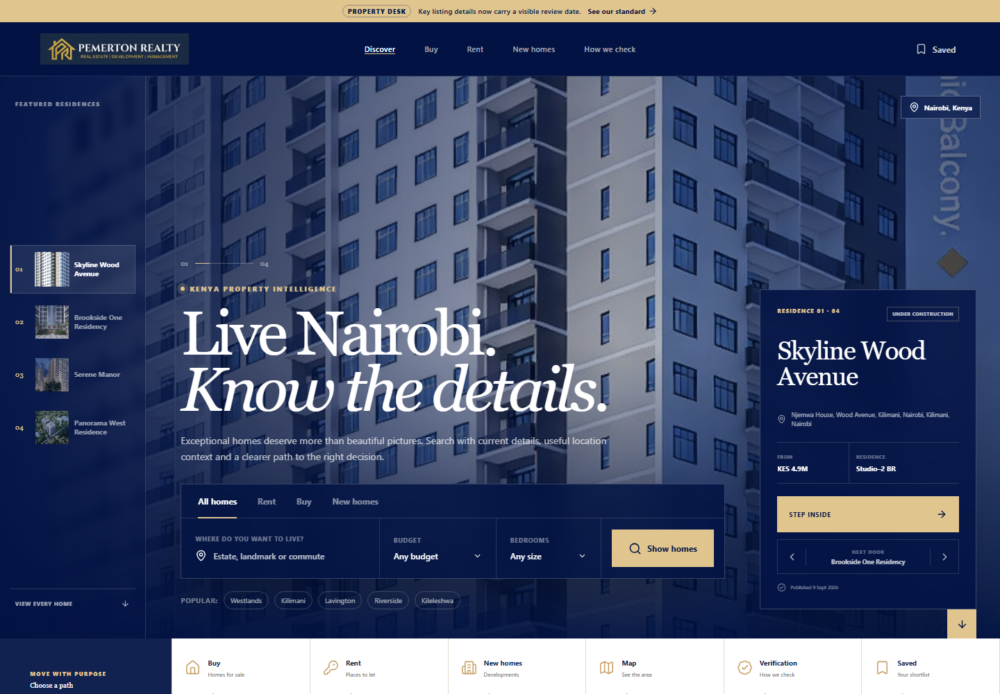

# Seraphim and Pemerton Realty

A property-discovery application with search, map/list views, comparisons and property-detail pages connected to an editorial catalogue.

**My role:** Full-stack development  
**Stack:** React, TypeScript, Fastify, PostgreSQL/PostGIS and Payload CMS

## What I built

- Property search and responsive list/map interfaces.
- Comparison and residence-detail views.
- Integration with a versioned property API and editorial CMS.
- API response validation, request cancellation and handling for unavailable catalogue data.

## Engineering decisions

A shared catalogue API connects the different browsing views to the same property data. PostGIS supports the application's geospatial data, while the CMS provides the editorial side of the catalogue.

The frontend API client validates responses and handles cancelled requests and unavailable listings. These behaviours are part of making a data-driven interface work beyond its initial screen.

**Demonstrated capabilities:** React/TypeScript development, API integration, geospatial data, content workflows and interface error handling.

[Back to portfolio](../README.md)
